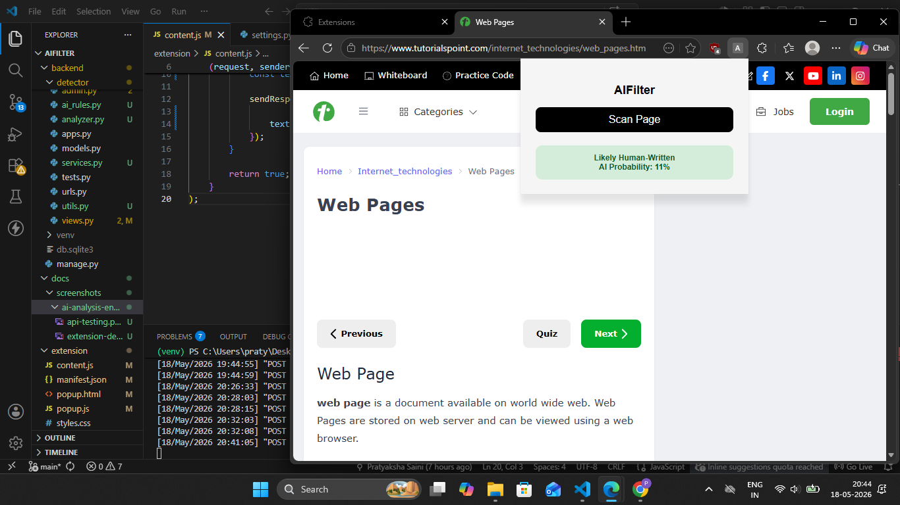
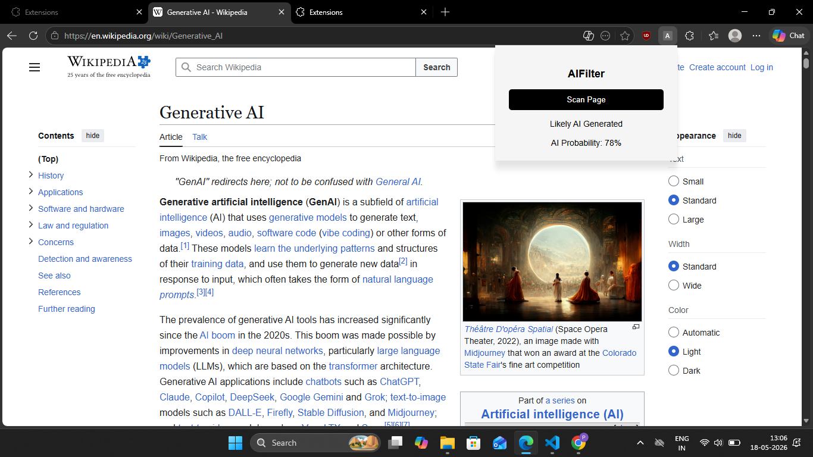
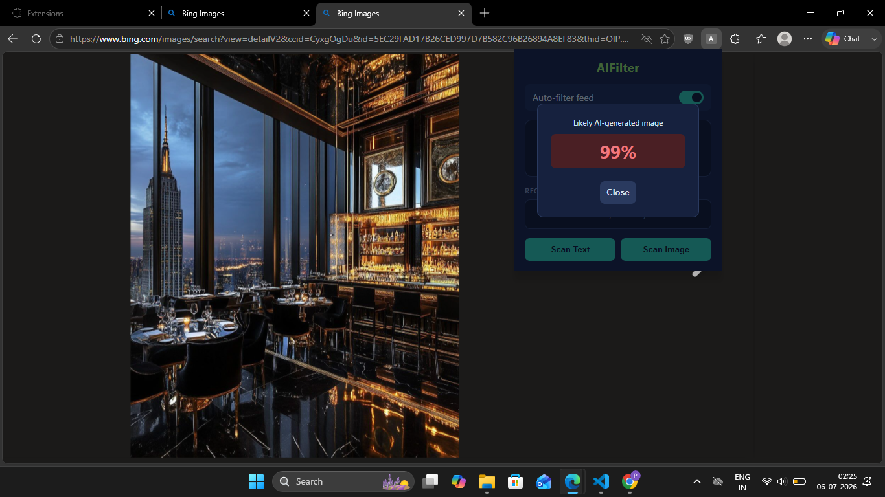
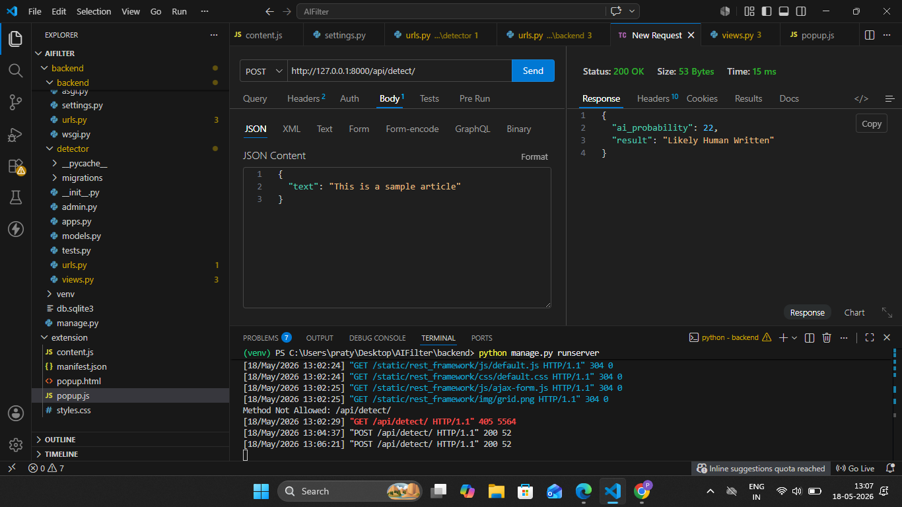

# AIFilter

AIFilter is a browser-based AI content analysis system that analyzes AI-generated content (text and images) on web pages and social media feeds, and automatically hides it — similar to how an ad blocker works, but for AI-generated content.
## Problem

AI-generated content is increasing rapidly and becoming more difficult to identify as models continue improving. 
Sometimes it becomes hard to realize whether content is human-written or AI-generated.

## Why I Built This

I built AIFilter to help users understand how AI-like the content they are viewing appears to be.
My long-term goal is to give users more control over their feed by allowing them to detect, reduce, or filter AI-heavy content on platforms such as YouTube, Instagram, and other platforms.

I also want to explore features where users can decide how much AI-generated content they want in their feed.

## Features

- **Auto-filter feed** — toggle on to continuously scan YouTube, Facebook, and Instagram feeds in the background. Cards whose text or thumbnail score above a threshold are automatically hidden.
- **Scan Text** — manually check the visible text of any page for AI-writing patterns.
- **Scan Image** — manually check the main image on any page for signs of AI generation.
- **Blocked items list** — see a running count and list of everything hidden on the current page, with individual scores.

## Current Detection Signals

- AI-style phrases
- Sentence uniformity
- Vocabulary diversity
- Long polished text patterns
- Burstiness variations

Currently scans approximately the first 5000 characters of webpage text.

## Tech Stack

### Backend
- Python
- Django
- Django REST Framework

### Frontend
- JavaScript
- HTML
- CSS
- Edge/Chromium Extension APIs

## How It Works

```text
Browser Extension
        ↓
Django Backend
        ↓
Analysis Engine
        ↓
AI Probability Score
        ↓
Result in Extension
```

### Text detection (`backend/detector/analyzer.py`)
A rule-based scoring system (no ML model) that checks:
- Presence of common AI-style phrases
- Text length
- Sentence-length uniformity (AI text tends to have more uniform sentence lengths than human writing)
- Vocabulary diversity (ratio of unique words to total words)
Each signal contributes points toward a 0–100 score, which is then classified as *Likely Human-Written*, *Possibly AI-Generated*, or *Highly AI-Likely*.
 
### Image detection (`backend/detector/image_analyzer.py`)
Uses the pre-trained Hugging Face model [`umm-maybe/AI-image-detector`](https://huggingface.co/umm-maybe/AI-image-detector) to classify an image as artificial or human-made, based on patterns learned from training data.
 
### Extension (`extension/`)
- `content.js` — injected into supported pages. Scans feed cards (when auto-filter is on), extracts text/thumbnail, sends them to the backend, and hides cards that score above the threshold.
- `popup.html` / `popup.js` — the UI: toggle switch, live blocked-count, blocked-items list, and manual Scan Text / Scan Image buttons.

## Screenshots

### Extension Result


### Extension Demo


### Extension Demo


### API Testing


## Future Improvements

- Deepfake/media detection
- Public deployment

## How To Run
 
### 1. Backend
 
```bash
cd backend
python -m venv venv
venv\Scripts\activate        # Windows
# source venv/bin/activate   # macOS/Linux
pip install -r requirements.txt
python manage.py migrate
python manage.py runserver
```
 
Keep this running — the extension talks to `http://127.0.0.1:8000`.
 
### 2. Extension
 
1. Go to `chrome://extensions`
2. Enable **Developer mode**
3. Click **Load unpacked** and select the `extension/` folder
4. Click the AIFilter icon in your toolbar to open the popup

## License

MIT License
